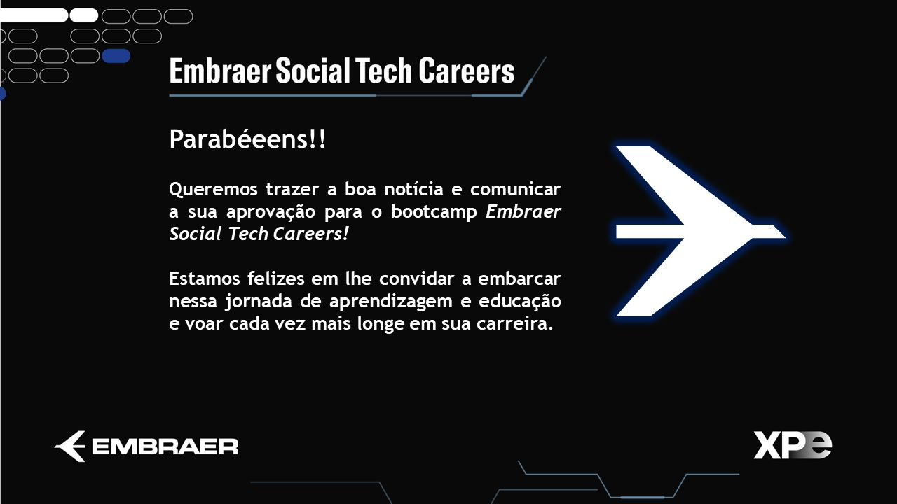

[Documentação Python](https://docs.python.org/pt-br/3/tutorial/)

> Este container será utilizado para guardar práticas que serão utilizadas para o curso da embraer em parceria com a xpe education.

<h4>Tipos Numéricos:</h4>
<ol>
    <li>Função abs;</li>
      <li>Exemplo de Casting;</li>
      <li>Divisão de inteiros;</li>
      <li>Multiplicação de inteiros;</li>
      <li>Potencição;</li>
      <li>Quociente da divisão;</li>
      <li>Resto da Divisão;</li>
      <li>Subtração e Soma de dois numeros;</li>
</ol>

<h4>Operadores Boleanos:</h4>
<ol>
    <li>Operador and;</li>
    <li>Operador not;</li>
    <li>Operador or;</li>
</ol>

<h4>Operadores de Comparação:</h4>
<ol>
    <li>Operador Maior Igual >= ;</li>
    <li>Operador Maior Que > ;</li>
    <li>Operador Diferente != ;</li>
    <li>Operador Igual == ;</li>
    <li>Operador Menor Igual <= ;</li>
    <li>Operador Menor < ;</li>
</ol>

<h4>Algoritimo de Resolução Desafio e Trabalho Prático Software para Iniciantes:</h4>
<ol>
    <li>Algoritmo desafio_pratico.py ;</li>
    <li>Algoritmo desafio_primo_menores.py ;</li>
    <li>Algoritmo desafio_primo;</li>
</ol>
